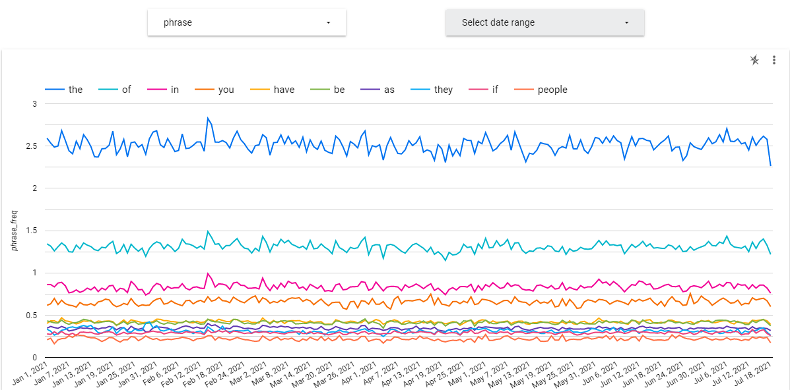
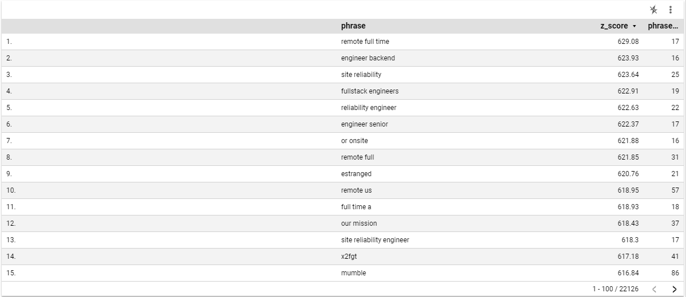

# Google BigQuery and Data Studio for Trend Analysis in Natural Language Corpora
Jamie Czerwinski

## Research Problem

Automated identification of trending topics within natural language corpora has the potential to serve a number of business functions. For example, contact centre leaders might be interested to know which topics drive changes in contact volumes; similarly, product managers may want to understand how users are responding to a change in their product.

Text classification methods are an obvious candidate for this use case; however, supervised topic classification may not be an effective approach for trending topic identification for two primary reasons:

1. Classification presupposes a predefined list of topics, which precludes the identification of new trending topics.
2. Supervision requires manual labelling, which is time consuming and may be error prone.

These problems can be avoided by using a phrase frequency outlier identification approach to identifying trending topics. Such an approach has the potential to provide fully automated and flexible identification of trending topics of interest.

Google is a notable user of this method. Both the [Google Ngram Viewer](https://books.google.com/ngrams) and [Google Trends](https://trends.google.com/trends/?geo=CA) use phrase frequency techniques to surface trends in books and search phrases respectively.

## Research Methods

Google BigQuery was used to compute a number of daily and 30-day n-gram statistics on the Hacker News post and comment data set. These statistics were computer for 1, 2, and 3-grams. We will call these n-grams "phrases" in the rest of this paper. Two visualizations were developed:

1. [Phrase Explorer - A visualization that enables users to compare frequency of a number of phrases over time.](https://datastudio.google.com/reporting/2deeb63e-2ee8-43c9-b62b-ada130ad508e)
2. [Trend Explorer - A visualization that lists phrases that are top outliers from their usual frequency distribution.](https://datastudio.google.com/reporting/a016746b-7546-46c5-b1d5-a259c33ee0d4)

The Phrase Explorer enables users to test hypotheses about specific phrases. For example, if a marketing manager wanted to know if their product was being discussed on Hacker News after the launch of an advertising campaign, they could enter the name of their technology product and view its frequency within posts and comments over time. Or, if a contact centre manager wanted to test the hypothesis that a spike in incoming telephone calls was related to the Olympics, they could enter "olympics" and see if an increase in its frequency correlates with the increase in incoming calls. 

The Trend Explorer is a table that shows, for the past month, the phrases that have occurred the highest frequency relative to their usual frequency distribution as measured by their z-score. That it, it shows phrases with frequencies that are top upper-outliers. In this case, it appears that a number of technology job posting related phrases dominate the upper outlier list, suggesting that previous efforts to limit job postings on Hacker News may be failing.

## Algorithms and programming details

The full implementation of this algorithm is given in [queries/queries.sql](queries/queries.sql).

1. For each document:
  1. Normalize and tokenize the document into words.
    a. Lowercase the document
    b. Delete all non-alphanumeric and non-space characters (eg. punctuation)
    c. Replace all whitespace with single spaces
    d. Split this text into tokens
  2. Generate a dated list of all 1, 2, and 3-grams from these tokens.
2. Count the number of occurences of each phrase for each day.
3. Count the number of documents for each day.
4. For each phrase/day combination, compute the phrase frequency mean and standard deviation over the previous 30 days.
5. For each phrase/day combination, compute the z-score of that days phrase frequency relative to the 30 day mean and standard deviation.

To find top trending phrases, Google Data Studio was used to filter the data set to a 30 day window, and to select the phrases with maximum z-scores having at least 15 occurences within the 30 day window.

## Research data, tools, and experimental environments

[Google BigQuery](https://cloud.google.com/bigquery) and [Google Data Studio](https://datastudio.google.com/) were the primary tools and environments used for this study. The analysis cost approximately $10 CAD to perform on these services.

### Data

BigQuery's public [Hacker News dataset](https://console.cloud.google.com/marketplace/product/y-combinator/hacker-news) was used for this study. It includes the full history of all Hacker News forum posts and comments since 2006.

### Google BigQuery Environment Setup

1. Navigate to [console.cloud.google.com](http://console.cloud.google.com). Create a Google account and/or login first if necessary.

2. Click into the project selector:
![step02.png]

3. Click "NEW PROJECT":
![step03.png]

4. Name your project "trends":
![step04.png]

5. Search for and navigate to BigQuery from within your new project:
![step05.png]

6. Navigate to the Create dataset dialog.
![step06.png]

7. Create a dataset named trends:
![step06.png]

6. Run the queries in [queries/queries.sql](queries/queries.sql) in the editor window that opens in your browser.

## Research results and discussion

### Phrase Explorer

Of the two final visualization products resulting from this study, the first -- the Phrase Explorer -- is simple, intuitive, and easy to use. It has a clear function and serves it directly and well -- allowing users to visualize and compare the frequency of different phrases within a corpus over time. While this functionality is useful, it also requires users to test pre-formed hypotheses -- it does not automatically identify and surface trending phrases. Another issue is that Google Data Studio appears to limit which phrases can be selected in the interface -- rare phrases do not appear as options in the phrase selector. This is a serious limitation and would need to be addressed in any production version of this system.

### Trend Explorer

The Trend Explorer interface does appear to be effective at identifying and surfacing trending phrases, but because of the Phrase Explorer's limited ability to display rare phrases, this was difficult to validate. Further, the methodology used to identify outlier phrases was not particularly well justified or validated; why were z-scores used to identify outliers? Why was a 30 day window used? Why were phrases with very low frequencies excluded? These choices were admittedly made rather arbitrarily in a way that seemed to result in "reasonable" output within the Trend Explorer interface, but the development of theoretically and empirically motivated algorithms for surfacing these trends may lead to better results.

One issue with this implementation is that many of the z-scores computed in this study have implausibly large magnitudes -- on the order of +/- 600, implying all-but-impossible phrase frequency lilkihoods. This may be the result of "catestrophic cancellation" or "loss of significance" -- a phenomenon where errors in floating point calculations are magnified.

Another opportunity for improvement with the Trend Explorer is to display time-series visualizations of the frequency of trending phrases. This would provide users with immediate exposure to how the frequency of the trending phrase has changed over time -- how quickly did the phrase frequency increase? Did the frequency spike for a single day and drop back down, or was the increase sustained?

### Zero Phrase Count Days

Many relatively infrequent phrases occur zero times on any given day. These zero-count phrase-days are important because their treatment can have a material impact on outlier detection. Proper accounting for zero-count phrase-days requires explicit treatment because counting phrases on days that they happen to occur implicitly excludes them. Including them requires manually inserting zero-count phrase-days in phrase-count data by computing the Cartesian product of phrases and days and assigning these phrase-days a phrase-count of zero if no explicit phrase-count exists. Because phrase space is large and most phrases are rare, this Cartesian product is likely to be extremely large -- much larger than phrase-count data that excludes zero-count phrase-days.

This study did not include phrase/day pairs with a phrase count of zero in its analysis. A query to include this data failed after running for four hours. While it may be possible to include this data using a similar methodology by configuring and/or purchasing more compute resources, this was not done for this study. Proper accounting for zero-count phrase-days presents an opportunity for further study.
